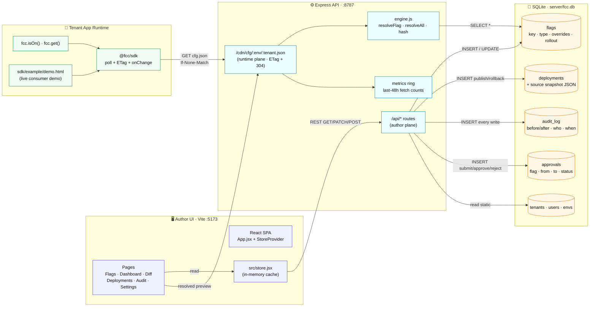

# FCC — Architecture Diagram

Two-plane design: an **author plane** for editing flags and a **runtime plane** for clients to read them. The same resolution engine runs in both so the preview drawer in the UI gives byte-identical output to what an SDK consumer sees.

## What each plane is responsible for

**Author plane** (`/api/*`)
- Writes are the only place that mutates `flags`, `deployments`, `approvals`.
- Every write also inserts into `audit_log` so the history is immutable from the route layer's perspective.
- `POST /api/deployments` snapshots the *full source* of all flags (overrides + rollout) into `deployments.snapshot`. This is what rollback restores from.

**Runtime plane** (`/cdn/cfg/:env/:tenant.json`)
- Read-only. Calls `resolveAll(flags, ctx)` against live flag rows.
- Emits an `ETag` derived from the resolved features hash, so the SDK can poll cheaply with `If-None-Match` and get `304 Not Modified` until something actually changes.
- `metricsRecord()` ticks the in-memory 48-hour ring buffer that the dashboard sparkline reads.

**Resolution engine** ([server/engine.js](../server/engine.js))
- Lifted verbatim from [src/data.js:394-448](../src/data.js#L394-L448) so the in-browser preview drawer and the CDN endpoint give identical output.
- Override layer order (highest wins): `default → env → tenant/env → platform → browser → rollout`.

## Why SQLite (and not something fancier)

- Zero infra to demo locally — one file at `server/fcc.db`.
- WAL mode → reads don't block writes.
- Schema is small enough (5 tables) to migrate to Postgres in a few hours when scale demands.
