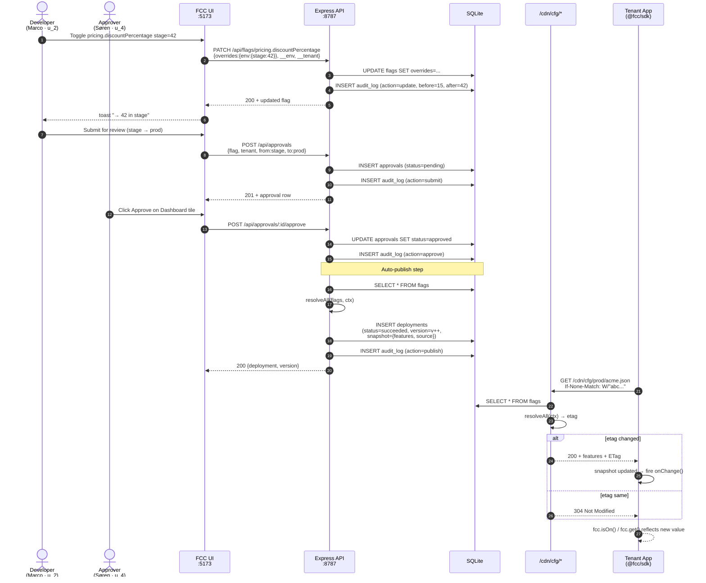
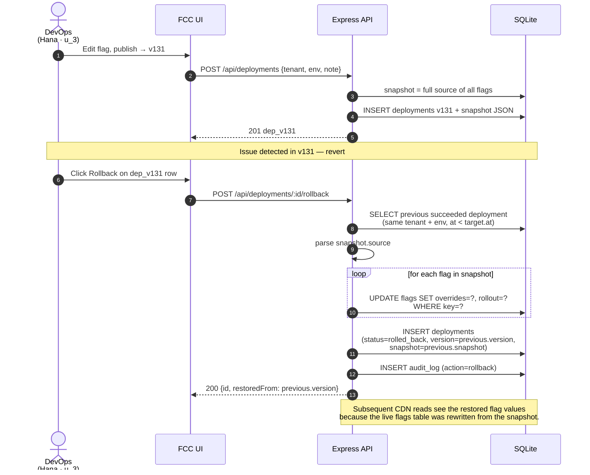
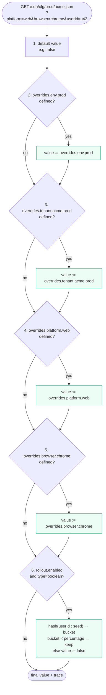

# FCC — End-to-End Flow Diagrams

Three diagrams covering the main lifecycle: author → review → publish → rollout → rollback.

---

## 1. Author → Approve → Publish → Client reads

**Why auto-publish on approve**: in the demo we collapse approve → publish into one route. In a real system these are separate steps gated by RBAC (the approver may not be the publisher) and by CI checks.

---

## 2. Publish → Rollback (snapshot-based revert)

**Key design choice**: snapshots store the *source* (overrides + rollout per flag), not just the resolved features. That way a rollback can deterministically restore the exact author state, even after platform/browser overrides change between snapshots.

---

## 3. Resolution layer order (what the engine does on every CDN read)

The "dominated" chip in the flag row UI fires when steps 4-5 override the value the row toggle controls (steps 2-3) — that explains why the row toggle visibly flips but the resolved column doesn't budge.

---

## Files that implement each piece

| Diagram step | File |
|---|---|
| UI toggle → PATCH | [src/pages-flags.jsx:336-360](../src/pages-flags.jsx#L336-L360) |
| API PATCH handler | [server/routes/flags.js](../server/routes/flags.js) |
| Audit insertion (every write) | each route under [server/routes/](../server/routes/) |
| Approval auto-publish | [server/routes/approvals.js](../server/routes/approvals.js) |
| Snapshot at publish | [server/routes/deployments.js](../server/routes/deployments.js) (POST `/`) |
| Snapshot-based rollback | [server/routes/deployments.js](../server/routes/deployments.js) (POST `/:id/rollback`) |
| CDN + ETag + 304 | [server/routes/cdn.js](../server/routes/cdn.js) |
| Resolution engine | [server/engine.js](../server/engine.js) |
| SDK polling + onChange | [sdk/src/index.js](../sdk/src/index.js) |
